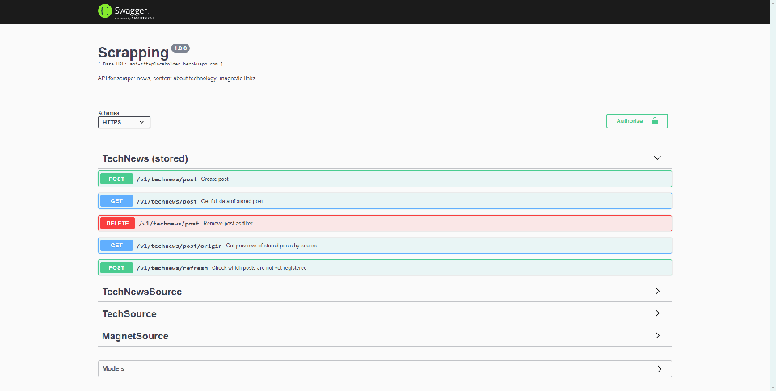

# Scrapping

<div flex-direction="row">
  
  
  
</div>

<div align="center">
    
</div>
<br />
<strong>API para coletar/raspar em outros sites: notícias, conteúdos sobre tecnologia; magnetic links.</strong>

## Demonstração

Caso deseje visualizar os endpoints, você pode acessar <a href="https://api-siteplaceholder.herokuapp.com/v1/docs">este link</a>.

## Conteúdos
.[TechNews - notícias sobre tecnologia](https://api-siteplaceholder.herokuapp.com/v1/doc/#/TechNews%20(stored))
.[Canais sobre Tecnologia, Desenvolvimento e Programação em Português.](https://api-siteplaceholder.herokuapp.com/v1/doc/#/TechSource/get_v1_tech_source_channels_br)
.[Meetups de tecnologia](https://api-siteplaceholder.herokuapp.com/v1/doc/#/TechSource/get_v1_tech_source_meetups)
.[Empresas que usam React no Brasil](https://api-siteplaceholder.herokuapp.com/v1/doc/#/TechSource/get_v1_tech_source_react_br)
.[Filmes para hackers](https://api-siteplaceholder.herokuapp.com/v1/doc/#/TechSource/get_v1_tech_source_movies)
.[Busca de magnet links](https://api-siteplaceholder.herokuapp.com/v1/doc/#/MagnetSource/get_v1_magnet_source_search)

# Para executar locamente:

#### 1.Pré-requisitos

Antes de começar, você vai precisar ter instalado em sua máquina as seguintes ferramentas:
[Git](https://git-scm.com), [Node.js](https://nodejs.org/en/).
Além disto é bom ter um editor para trabalhar com o código como [VSCode](https://code.visualstudio.com/)

#### 2.Instalação

Para a instalação do projeto, primeiramente baixe o <a href="https://nodejs.org/en/">Node.js</a>.

Após a instalação do Node, você deve clonar o repositório:
```bash
git clone https://github.com/MarceloVilela/scrapping.git
```
Após a clonagem, execute o comando abaixo dentro da pasta do projeto para baixar todas as dependências:
```bash
npm install
```

#### 3.Variáveis ambiente
-Crie um arquivo .env,
copie o conteúdo do arquivo .env.example e cole dentro de .env,
altere caso necessário.

-Crie um arquivo ormconfig.json,
copie o conteúdo do arquivo ormconfig.json.example e cole dentro de ormconfig.json,
altere caso necessário.

#### 4.Como utilizar

Após clonar, execute o comando abaixo:

```bash
npm run dev:server
```

Abra [http://localhost:3333](http://localhost:3333) em seu navegador para utilizar a aplicação.
