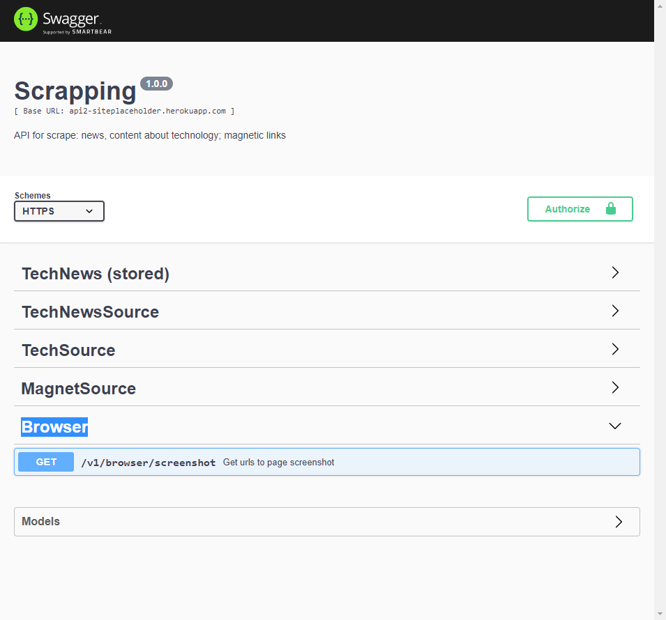

# Browser

#### About

Endpoints to use browser automation.
-page screenshot

#### Api documentation
[Api documentation](https://api2-siteplaceholder.herokuapp.com/v1/doc/#/Browser)

#### Access
[Try it out](https://api2-siteplaceholder.herokuapp.com/v1/browser/screenshot?browserUrl=https%3A%2F%2Fdevfinder.vercel.app%2F&user=marcelovilela&browserPosY=80)
