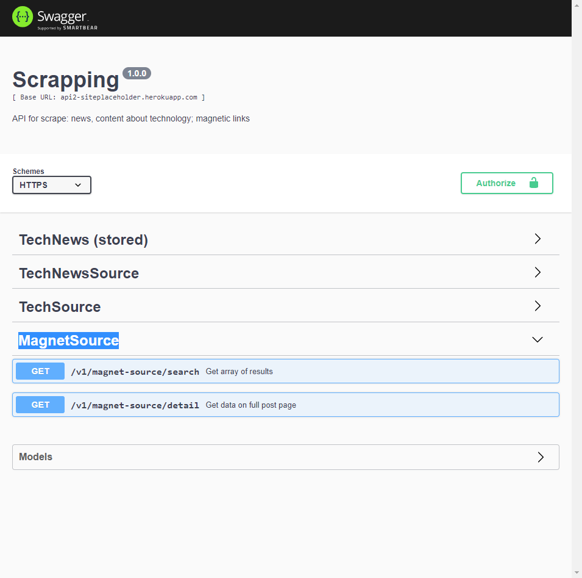
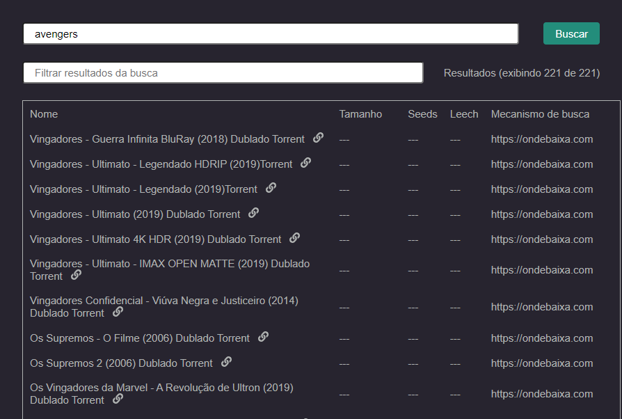

# Magnet Source

#### About

Search engines for magnet-links

#### Api documentation
[Api documentation](https://api2-siteplaceholder.herokuapp.com/v1/doc/#/MagnetSource)

#### App preview

Used as backend to find links without needing sites manually, one by one, like [QBittorrent](https://github.com/qbittorrent/search-plugins/wiki/Unofficial-search-plugins#plugins-for-public-sites)

#### Access
[Go to live app](http://magnet-finder.netlify.app/)
