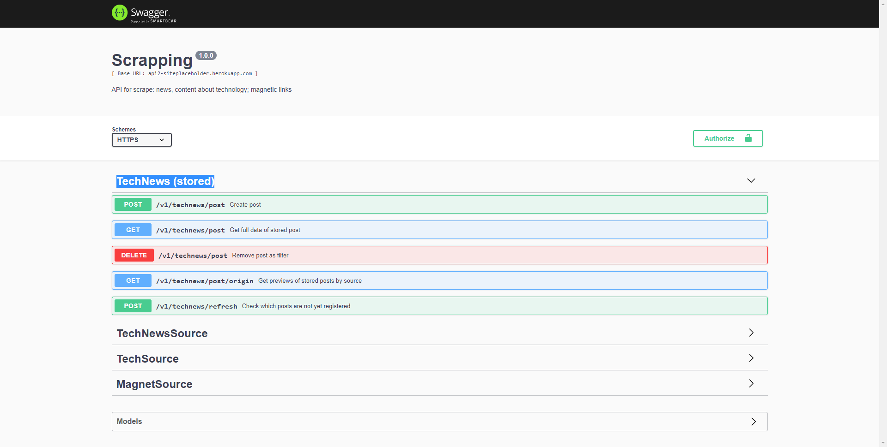

# Tech News Stored

#### About

-In this module are the persistence operations.
-The app queries the endpoints of this module to generate the article listing and get the article details.

#### Api documentation
[Api documentation](https://api2-siteplaceholder.herokuapp.com/v1/doc/#/TechNewsSource)

#### App preview

Used to recreate the interface of the [Tech News](https://play.google.com/store/apps/details?id=it.pinenuts.technews&hl=pt_BR&gl=US) whit React Native

#### Access
[go to the app's github repository](https://github.com/marcelovilela/tech-news)
[go to expo](https://expo.io/@marcelovilela/Tech_News)
